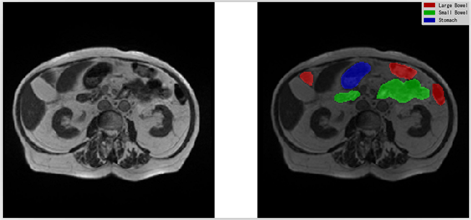
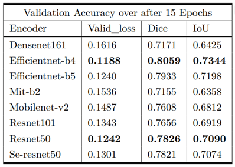
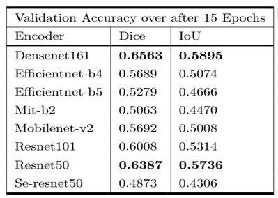

## [基于Res-UNet的医学影像分割]()

----



医学图像分割在临床诊断中发挥着重要作用，也是其他医学图像处理方法的基础。

而在传统的医学影像领域，放射肿瘤学家必须在 $CT$ 图上手动勾勒出胃和肠的位置，以便调整X射线束的方向，而这种工作往往是十分繁琐的，且不容易很好地勾勒出相应器官的轮廓，我们可用计算机视觉（$CV$）领域中的语义分割来进行实现。

我们将 $UNet$ 和 $ResNet$ 进行整合，来作为我们的主要网络模型。模型可用于对输入的肠胃道 $CT$ 图进行识别，分别分割出大肠、小肠和胃。受具体图像影响可能较大，分割效果并不一定总是很好，但我们期待能有一定参考价值，并能在一定程度上起到辅佐医生诊断的作用。

通过该命令可以安装本项目所依赖的各种库。

```
pip install -r requirements.txt
```

运行 $Predict.py$ 文件可以直接打开本项目设计的 $GUI$ 界面。

各个 $py$ 文件的简单介绍可见附录部分。

### 数据集：

本项目中数据集的来源为 [kaggle 网站中肠胃道图像分割比赛]([UW-Madison GI Tract Image Segmentation | Kaggle](https://www.kaggle.com/competitions/uw-madison-gi-tract-image-segmentation))，肠胃道图像来自 $85$ 名真正的癌症患者，他们在放射治疗期间在不同的日子里进行了 $1-5$ 次核磁共振成像扫描，每次扫描会截取 $144$ 张单通道图像，共 $38496$ 张图片，其中大肠、小肠、胃出现图片比例分别为，$14085$ $:$ $11201$ $:$$8627$。

### 方法：

在训练前，我们对数据进行了一些数据增强操作，包括：

- 以一定概率对图片进行水平翻转；
- 以一定概率对图片进行平移、缩放、旋转操作；
- 以一定概率对图片进行网格畸变或弹性畸变操作；
- 以一定概率对原图进行部分遮挡。

我们利用 $K$ 折交叉检验将原数据集按照 $5 : 1$ 的比例划分为训练集和测试集，训练集中每个 $batch$ 的大小为 $64$，测试集中每个 $batch$ 的大小为 $128$；

训练过程中里利用了自动混合精度训练策略、梯度累加等技巧加速了模型训练、提升了模型进行语义分割的效果；

关于优化器，我们选取了 $Adam$ 优化器，并设置参数 $weight_decay$ 为 $1e-6$；

关于学习率，我们设置了初始学习率为 $0.001$，并利用基于模拟退火算法的 $CosineAnnealingLR$ 调度器在训练过程中动态调整学习率大小；

关于损失函数，我们结合了 $BCELoss$ 与 $TverskyLoss$，二者分别以 $0.5$ 与 $0.5$ 的权重相加作为我们的损失函数。

### 实验结果对比：

除了 $Res-Unet$ 模型外，我们还使用了不同的编码器，训练出了效果各异的模型。为了对比它们的分割效果和泛化性，我们使用了原测试集，以及由原测试集中每张图片的一个子区域部分组成的一个新的测试集上，通过 $Dice$ 系数和 $IoU$ 系数测试比较了它们的语义分割效果。其中，在原测试集上的语义分割效果如表 $1$ ，在新测试集上的语义分割效果如表 $2$ 所示：

<center> 表1：各个模型在原测试集上的分割效果



<center> 表2：各个模型在新测试集上的分割效果



可以看出，$Resnet50$ 作为编码器时，在原测试集上和新测试集上分割效果均不是最优的，但综合两个测试集的表现考虑，$Resnet50$ 相对要更优一些。这也是我们最终选取 $Resnet50$ 作为我们模型的编码器的原因。

### 附录：本项目各个 $py$ 文件及内部类、函数、变量的简单说明：

#### config.py 文件：

> 项目的参数配置相关。

- 类 $CFG$：统一保存了本项目中使用的一些参数；
- 函数 $set\_seed$ ：设置各个随机种子的值，保证了程序每次运行的结果均相同；

#### dataset.py 文件：

> 与数据集的读取相关。

- 类 $BuildDataset$ ：自定义一个 $torch$ 的 $Dataset$ 类，重写了 $\_\_len\_\_$ 方法和 $\_\_getiem\_\_$ 方法，用于实现对数据的读取；
- 类 $DataLoader$ ：根据设定的一些参数读取不同的数据；
- 变量 $df$：一个已经去除脏数据的表格，有五列，分别为 $id$、$image\_path$、$mask\_path$ 、$empty$ 和 $fold$，其中 $image\_path$ 表明了图像在文件中的存储路径， $mask\_path$ 指示了相应的掩码的存储路径，$fold$ 是指将数据集划分为 $n\_fold$ 折后，该图片属于哪一折。

#### utility.py：

> 实现了一些方便的函数。

- 函数 $load\_img$：根据输入文件路径读取图片；
- 函数 $load\_msk$：根据输入文件路径读取掩码；
- 函数 $png2tensor$：根据输入文件路径读取对应的图片、掩码并转化为张量；

- 函数 $show\_img$：展示图像（和掩码）；
- 函数 $plot\_batch$：展示一个批次的图像（和掩码）；
- 函数 $zipDir$：将指定路径的文件打包成一个 $zip$ 压缩包；
- 变量 $data\_transforms$：实现数据增强操作；

#### model.py：

> 与模型的构建相关。

- 函数 $build\_model$：根据 $CFG$ 中的 $backbone$ 参数构建相应的模型；
- 函数 $load\_model$：根据目标路径和 $backbone$ 类型加载模型；

#### run_train.py：

> 与模型的训练相关。

- 函数 $dice\_coef$ 与 $iou\_coef$：计算语义分割中常用的两种指标 $dice$ 与 $iou$；
- 函数 $criterion$：损失函数的实现；
- 函数 $train\_one\_epoch$：每一轮训练过程的具体实现；
- 函数 $valid\_one\_epoch$：验证过程的实现；
- 函数 $run\_training$：全部训练过程的实现；
- 函数 $fetch\_scheduler$：为学习率选取调度器；

#### run_predict.py：

> 编写了一些对比不同模型性能的函数。

- 函数 $Predict$：输入模型集合、图像、掩码，输出图像、掩码、不同模型预测的结果对比图；
- 函数 $GetPartImageAndMask$ ：输入图像、掩码，截取原图像、掩码的一小部分；
- 函数 $RandomSave$ ：随机选取若干张图片保存在当前路径下；
- 函数 $PredictWithLabel$：只选取有掩码的图像进行测试对比；
- 函数 $PredictWithNoLabel$：只选取无掩码的图像进行测试对比；
- 函数 $PredictWithPart$：随即截取若干张图像的局部图像，并进行单个模型的测试；
- 函数 $PredictionCompare$：随即截取若干张图像的局部图像，并进行多个模型的测试与对比；

#### Predict.pt：

> 编写了实现GUI各类功能的函数。

- $btnInput\_Clicked$：输入单张图片；
- $btnmultiInput\_Clicked$：输入多张图片；
- $btnTest\_Pressed$：实现单图或多图分割；
- $btnonlyLargeBowel\_Clicked$：实现单独分割大肠；
- $btnonlySmallBowel\_Clicked$：实现单独分割小肠；
- $btnonlyStomach\_Clicked$：实现单独分割；
- $Repaint$：实现在滑鼠滑动或左键拖动时重绘分割图；
- $wheelEvent$：实现滑鼠滑动使图像缩放的功能；
- $mouseMoveEvent$：实现左键拖动使图像平移的功能；